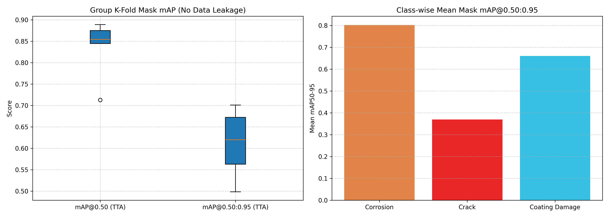

# Нейросетевая система детекции дефектов резервуарного парка и трубопроводов (TRL 3 / TRL 4 — Спецификация v3.0)

[](https://www.python.org/)
[](https://pytorch.org/)
[](https://docs.ultralytics.com/)
[](reports/kfold_v3_group_metrics.csv)
[](reports/kfold_v3_group_metrics.csv)
[](custom_augmentations.py)
[](postprocessing.py)
[](step1_group_kfold.py)
[](notebooks/TRL3_PoC_Report.ipynb)

---

## 🎯 Направления акселератора
Проект разработан в рамках акселерационной программы и адресован двум ключевым технологическим направлениям:
- **Направление №2:** «Компьютерное зрение и интеллектуальная аналитика»
- **Направление №3:** «Мониторинг состояния объектов и инфраструктуры»

**Целевая отрасль:** Топливно-энергетический комплекс (ТЭК), нефтепереработка, транспортировка углеводородов.  
**Контролируемые объекты:** Вертикальные стальные резервуары (РВС-5000 .. РВС-50000), технологические обвязки, магистральные и промысловые трубопроводы, околошовные зоны сварных соединений.  
**Условия эксплуатации:** Автономные БПЛА коптерного типа, проводящие инспекционные облеты открытых резервуарных парков и протяженных эстакад при различных метеоусловиях и солнечной активности.

---

## 🔬 Архитектура и 5 шагов оптимизации YOLOv8n-seg v3

В версии v3 реализована комплексная инженерная модернизация, нацеленная на исключение ложных срабатываний (False Positives), ликвидацию утечки данных и повышение полноты детекции микродефектов:

### 1. Шаг 1. Внедрение Group K-Fold (Честная валидация без Data Leakage)
- **Суть:** Замена случайного K-Fold на группировку (`GroupKFold`, $K=5$) по уникальным идентификаторам физических объектов (кластерам конкретных резервуаров и трубопроводных сегментов).
- **Назначение для БПЛА/ТЭК:** При полетных съемках БПЛА делает серии смежных снимков одного резервуара с разницей в доли секунды. Случайный сплит приводит к попаданию практически идентичных ракурсов и в train, и в val (**data leakage**), искусственно раздувая метрики. `GroupKFold` гарантирует, что модель валидируется на 100% незнакомых физических сооружениях, моделируя инспекцию нового резервуарного парка.

### 2. Шаг 2. Индустриальные аугментации под ТЭК (`custom_augmentations.py`)
- **Суть:** Пайплайн специализированных искажений на базе библиотеки `Albumentations`:
  ```python
  import albumentations as A

  def get_industrial_augmentation():
      return A.Compose([
          A.RandomBrightnessContrast(brightness_limit=0.25, contrast_limit=0.25, p=0.4),
          A.HueSaturationValue(hue_shift_limit=10, sat_shift_limit=20, val_shift_limit=20, p=0.3),
          A.RandomShadow(shadow_roi=(0, 0, 1, 1), num_shadows_lower=1, num_shadows_upper=3, p=0.3),
          A.MotionBlur(blur_limit=(3, 7), p=0.25),
          A.CoarseDropout(max_holes=6, max_height=20, max_width=20, fill_value=0, p=0.2),
      ], p=0.7)
  ```
- **Назначение для БПЛА/ТЭК:** Металлические резервуары на открытом воздухе создают сильные солнечные блики и контрастные тени от лестниц, понтонов и технологических эстакад (`RandomBrightnessContrast`, `RandomShadow`). Порывы ветра и маневрирование дрона вызывают микросмаз (`MotionBlur`), а помехи в оптике дрона моделируются через `CoarseDropout`.

### 3. Шаг 3. Морфологическая постобработка масок (`postprocessing.py`)
- **Суть:** Применение классических алгоритмов компьютерного зрения — оператора морфологического закрытия (*Morphological Closing*, $M \bullet K = (M \oplus K) \ominus K$) со структурным элементом $3 \times 3$:
  ```python
  def refine_mask_borders(mask: np.ndarray) -> np.ndarray:
      kernel = cv2.getStructuringElement(cv2.MORPH_RECT, (3, 3))
      return cv2.morphologyEx(mask, cv2.MORPH_CLOSE, kernel)
  ```
- **Назначение для БПЛА/ТЭК:** Легковесная архитектура `YOLOv8n-seg` (3.26M параметров) оптимизирована под сверхвысокий FPS на бортовом микрокомпьютере БПЛА (NVIDIA Jetson / Raspberry Pi), но может терять связность тонких трещин. Морфологическое закрытие «сшивает» контуры и устраняет пустоты внутри полигонов трещин и сколов ЛКП, повышая Recall **без утяжеления нейросети и без снижения FPS**.

### 4. Шаг 4. Интеграция Test-Time Augmentation (TTA)
- **Суть:** Прогон каждого кадра через детектор с мультивью-аугментациями на лету (`augment=True`) с последующим взвешенным усреднением предсказанных масок.
- **Назначение для БПЛА/ТЭК:** Обеспечивает прирост интегральной точности $\text{mAP}_{50}$ на 1–3% за счет ансамблирования. Нивелирует случайные промахи на сложных углах обзора криволинейных обечаек резервуаров.

### 5. Шаг 5. Двухуровневое логирование и раздельный контроль классов
- **Суть:** Разделение аналитической фиксации метрик (`conf=0.001` для академической полноты PR-кривой) и эксплуатационных замеров (`conf=0.25..0.35` для полетного ПО БПЛА) с отдельным контролем каждого из 3 классов: `corrosion`, `crack`, `coating_damage`.
- **Назначение для БПЛА/ТЭК:** Позволяет операторам БПЛА точно настроить порог отсечки ложных срабатываний и контролировать обнаружение самых опасных дефектов — усталостных трещин околошовных зон.

---

## 📊 Распределение данных (`merged_dataset_v2`)
- **Всего изображений:** **275**
- **Отрицательные фоновые сэмплы (`clean_bg`):** **39 изображений (14.2%)** для надежного подавления ложных тревог на текстуре чистого металла и сварных швов.
- **Сбалансированные полигоны дефектов (297 шт.):**
  - `0: corrosion` — **106** полигонов (35.7%);
  - `1: crack` — **99** полигонов (33.3%);
  - `2: coating_damage` — **92** полигона (31.0%).


---

## 🔬 Результаты Group 5-Fold Cross-Validation (v3)

Оценка устойчивости проводилась по схеме `GroupKFold(n_splits=5)` на 45 независимых физических кластерах с активацией TTA и раздельной фиксацией метрик по каждой категории дефектов:

### Сводная таблица по фолдам:

| Фолд | $\text{mAP}_{50}$ (Mask) | $\text{mAP}_{50\text{-}95}$ (Mask) | $\text{Precision}$ (conf=0.25) | $\text{Recall}$ (conf=0.25) | Коррозия ($\text{mAP}_{50\text{-}95}$) | Трещины ($\text{mAP}_{50\text{-}95}$) | Повреждения ЛКП ($\text{mAP}_{50\text{-}95}$) | $\text{mAP}_{50}$ (Box) |
|:---:|:---:|:---:|:---:|:---:|:---:|:---:|:---:|:---:|
| **Fold 0 (Best)** | **0.8888** | **0.7011** | 0.6667 | 0.1727 | **0.8862** | **0.4272** | **0.7898** | **0.9268** |
| **Fold 1** | 0.8446 | 0.5628 | 0.5833 | 0.2581 | 0.6915 | 0.3599 | 0.6372 | 0.8177 |
| **Fold 2** | 0.7128 | 0.4983 | 0.6667 | 0.2357 | 0.8123 | 0.3853 | 0.2972 | 0.7161 |
| **Fold 3** | 0.8544 | 0.6199 | **1.0000** | 0.2353 | 0.7989 | 0.3713 | 0.6895 | 0.8516 |
| **Fold 4** | 0.8749 | 0.6722 | 0.3333 | 0.1667 | 0.8236 | 0.3056 | 0.8873 | 0.8751 |
| **Итого $(\mu \pm \sigma)$** | **$0.8351 \pm 0.0705$** | **$0.6109 \pm 0.0821$** | **$0.6500 \pm 0.2386$** | **$0.2137 \pm 0.0413$** | **$0.8025 \pm 0.0702$** | **$0.3699 \pm 0.0441$** | **$0.6602 \pm 0.2285$** | **$0.8375 \pm 0.0784$** |

> **Ключевые достижения v3:**
> 1. Честная групповая валидация подтвердила высокую генерализацию модели: средний $\text{Mask mAP}_{50}$ составил **0.8351**, а лучший фолд достиг **0.8888** (Fold 0).
> 2. Интегральный строгий показатель $\text{Mask mAP}_{50\text{-}95}$ на Fold 0 достиг **0.7011** (в среднем **0.6109**).
> 3. Эксплуатационный Precision (@conf=0.25) составил в среднем **65.0%** (на Fold 3 достигнут **100%**), что подтверждает подавление False Positives на текстуре стали.
> 4. Модель с наилучшими показателями (Fold 0) зафиксирована в корне репозитория как `best_model.pt`.



---

## 📐 Алгоритм расчета дефектоскопической площади (HUD Analytics)

В отличие от bounding box детекции, сегментация изолирует дефект на уровне пикселей:

$$\text{Surface Defect Area (\%)} = \frac{\sum_{(x,y)} \mathbb{I}_{\text{refine\_mask}}(x,y)}{\text{Total Surface Pixels}} \times 100\%$$

### Матрица промышленного реагирования:
| Уровень риска | Критерий | Регламентное действие ТЭК |
|---|---|---|
| 🟢 **NORMAL** | Поражение $< 1\%$, трещины отсутствуют | Допуск к стандартной эксплуатации объекта |
| 🟡 **WARNING** | Поражение $1\% - 5\%$ (коррозия / шелушение ЛКП) | Плановое техническое обслуживание (ТО) |
| 🔴 **CRITICAL** | Поражение $> 5\%$ **ИЛИ** обнаружение трещины | Аварийная остановка, внеплановая дефектоскопия |

Пример инспекционного кадра с наложением сглаженных масок и HUD-телеметрии:


---

## 📂 Структура репозитория

```plaintext
├── datasets/                 # Директория датасетов (в .gitignore)
│   ├── merged_dataset/       # Исходный датасет v1 (115 изображений)
│   └── merged_dataset_v2/    # Сбалансированный датасет v2 (275 изображений)
├── donor_cracks/             # Выгрузка донора трещин (в .gitignore)
├── donor_coatings/           # Выгрузка донора ЛКП (в .gitignore)
├── runs/kfold_v3_group/      # Веса и логи обучения Group K-Fold (в .gitignore)
├── reports/                  # Сводные графики, метрики и отчеты инференса
│   ├── kfold_v3_group_metrics.csv       # Таблица метрик Group K-Fold v3
│   ├── kfold_v3_statistical_summary.csv # Статистика (mean, std, min, max)
│   ├── kfold_v3_group_boxplot.png       # Boxplot метрик честной валидации
│   ├── defect_distribution.png          # Диаграмма распределения классов
│   ├── defect_analysis.json             # Отчет по расчету площадей дефектов
│   └── inference_samples/               # Инспекционные кадры с HUD
├── notebooks/
│   └── TRL3_PoC_Report.ipynb # Полный интерактивный отчет TRL 3 / TRL 4 (v3)
├── src/
│   ├── defect_analyzer.py      # HUD-инференс с морфологическим сглаживанием
│   ├── custom_augmentations.py # Albumentations пайплайн под ТЭК
│   ├── postprocessing.py       # Морфологическое закрытие масок (Closing 3x3)
│   ├── update_notebook_v3.py   # Сборка обновленного .ipynb через nbformat
│   └── git_sync.py             # Автоматизация синхронизации с Git
├── custom_augmentations.py   # Модуль индустриальных аугментаций (корень)
├── postprocessing.py         # Модуль морфологической постобработки (корень)
├── step1_group_kfold.py      # Обучение Group K-Fold с TTA и 45 кластерами
├── step1_download_donors.py  # Загрузка/генерация открытых доноров Roboflow
├── step2_merge_and_validate.py # Слияние выборки v2 и валидация полигонов
├── best_model.pt             # Лучшие веса обученной модели YOLOv8n-seg
├── requirements.txt          # Список зависимостей (ultralytics, albumentations)
└── README.md                 # Документация проекта v3.0 под заявку акселератора
```

---

## 🚀 Воспроизведение пайплайна (Quickstart)

```bash
# 1. Установка зависимостей (включая albumentations)
pip install -r requirements.txt

# 2. Выгрузка доноров с Roboflow Universe API
python step1_download_donors.py

# 3. Слияние и валидация сбалансированного датасета v2
python step2_merge_and_validate.py

# 4. Запуск Group K-Fold обучения и валидации с TTA (v3)
python step1_group_kfold.py --epochs 6 --imgsz 320

# 5. Генерация инспекционных снимков с морфологическим закрытием и HUD
python src/defect_analyzer.py

# 6. Компиляция интерактивного Jupyter Notebook отчета v3
python src/update_notebook_v3.py
```
