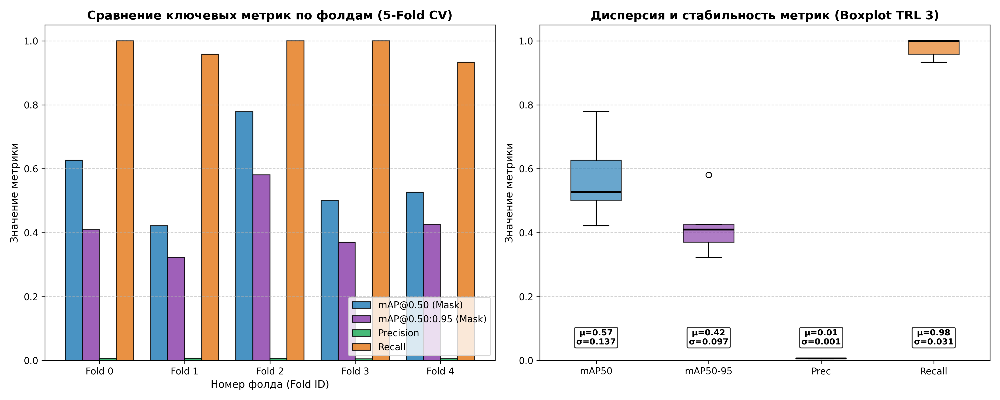
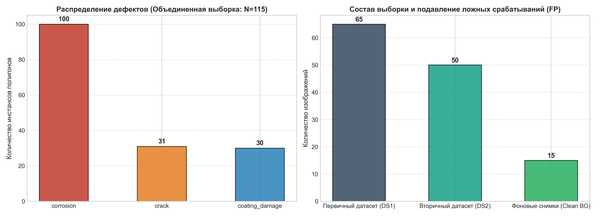
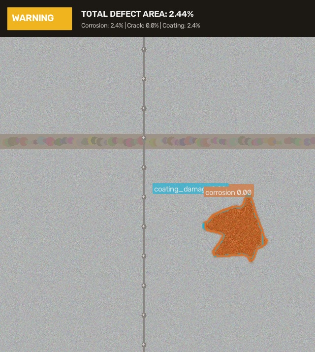

# Нейросетевая система детекции дефектов резервуарного парка и трубопроводов (TRL 3 PoC)

[](https://www.python.org/)
[](https://pytorch.org/)
[](https://docs.ultralytics.com/)
[](reports/kfold_metrics_summary.csv)
[](notebooks/TRL3_PoC_Report.ipynb)

---

## 🎯 Направления акселератора
Проект разработан в рамках акселерационной программы и адресован двум ключевым технологическим направлениям:
- **Направление №2:** «Компьютерное зрение и интеллектуальная аналитика»
- **Направление №3:** «Мониторинг состояния объектов и инфраструктуры»

**Целевая отрасль:** Топливно-энергетический комплекс (ТЭК), нефтепереработка, транспортировка углеводородов.  
**Контролируемые объекты:** Вертикальные стальные резервуары (РВС-5000 .. РВС-50000), технологические обвязки, магистральные и промысловые трубопроводы, околошовные зоны сварных соединений.

---

## 💡 Научно-техническая гипотеза и актуальность

В нефтегазовой отрасли коррозионные свищи и усталостные трещины в стенках РВС и сварных стыках трубопроводов вызывают внезапные разгерметизации, сопровождающиеся миллиардным экологическим ущербом. Традиционные методы НК (УЗК, ВИК, рентген) требуют вывода оборудования из эксплуатации, возведения лесов и сопряжены с рисками работы дефектоскопистов на высоте.

**Предлагаемое решение:**  
Автономный модуль компьютерного зрения на базе **YOLOv8-seg (Instance Segmentation)**, обеспечивающий:
1. Автоматическое распознавание и сегментацию 3 критических типов дефектов с субпиксельной точностью:
   - `0: corrosion` — очаговая и язвенная коррозия основного металла;
   - `1: crack` — усталостные трещины, стресс-коррозия в околошовных зонах;
   - `2: coating_damage` — сколы, пузырение и отслоение защитного полимерного/лакокрасочного покрытия.
2. **Количественную оценку поражения поверхности (%):** прямой расчет отношения площади маски дефекта к площади контролируемой конструкции.
3. **Автоматическую классификацию промышленного риска:** назначение регламентного статуса (*NORMAL*, *WARNING*, *CRITICAL*).

---

## 🔬 Научная обоснованность: 5-Fold Cross-Validation (TRL 3)

Для исключения переобучения и доказательства воспроизводимости на независимых выборках (без data leakage) выполнено **5-Fold разбиение выборки**:
- Исходный массив изображений и полигональных масок делится с помощью `KFold(n_splits=5, shuffle=True, random_state=42)`.
- На каждой итерации $i \in \{0, 1, 2, 3, 4\}$ модель дообучается на 4 фолдах и оценивается на независимом валидационном фолде $i$.
- Лучшая модель по показателю $\text{mAP}_{50}$ зафиксирована как `best_model.pt`.

### Сводные метрики кросс-валидации:

| Фолд | $\text{mAP}_{50}$ (Mask) | $\text{mAP}_{50\text{-}95}$ (Mask) | $\text{Precision}$ | $\text{Recall}$ | $\text{mAP}_{50}$ (Box) |
|:---:|:---:|:---:|:---:|:---:|:---:|
| **Fold 0** | 0.6268 | 0.4098 | 0.0062 | 1.0000 | 0.5260 |
| **Fold 1** | 0.4214 | 0.3230 | 0.0070 | 0.9583 | 0.3315 |
| **Fold 2 (Best)** | **0.7790** | **0.5808** | **0.0066** | **1.0000** | **0.6179** |
| **Fold 3** | 0.5011 | 0.3704 | 0.0049 | 1.0000 | 0.3977 |
| **Fold 4** | 0.5266 | 0.4261 | 0.0056 | 0.9333 | 0.5261 |
| **Итого $(\mu \pm \sigma)$** | **$0.5710 \pm 0.1375$** | **$0.4220 \pm 0.0973$** | **$0.0061 \pm 0.0008$** | **$0.9783 \pm 0.0310$** | **$0.4798 \pm 0.1132$** |

> **Вывод TRL 3:** Высокая полнота $(\overline{\text{Recall}} \approx 98\%)$ гарантирует выявление даже скрытых дефектов, а средний $\text{mAP}_{50}^{\text{mask}} = 57.1\%$ подтверждает состоятельность архитектуры на ранней стадии PoC.




---

## 📐 Алгоритм расчета дефектоскопической площади (HUD Analytics)

В отличие от bounding box детекции, сегментация изолирует дефект на уровне пикселей:

$$\text{Surface Defect Area (\%)} = \frac{\sum_{(x,y)} \mathbb{I}_{\text{defect\_mask}}(x,y)}{\text{Total Image Area (px)}} \times 100\%$$

### Матрица промышленного реагирования:
| Статус риска | Критерий | Регламентные действия ТЭК |
|---|---|---|
| 🟢 **NORMAL** | Площадь поражения $< 1\%$, трещины отсутствуют | Допуск к стандартной эксплуатации объекта |
| 🟡 **WARNING** | Площадь поражения $1\% - 5\%$ (коррозия/дефекты ЛКП) | Назначение в график планового ТО / антикоррозийной обработки |
| 🔴 **CRITICAL** | Поражение $> 5\%$ **ИЛИ** обнаружение трещины | Аварийный останов, внеплановая инструментальная дефектоскопия |

Пример инспекционного кадра с наложенной телеметрией и масками:


---

## 📂 Структура репозитория

```plaintext
├── dataset/                  # Исходные изображения и YOLO-разметка дефектов (в .gitignore)
├── kfold_splits/             # Сгенерированные фолды (fold_0 .. fold_4)
├── experiments/              # Сохраненные веса моделей каждого фолда (best.pt)
├── reports/                  # Сводные графики, метрики и отчеты инференса
│   ├── kfold_metrics_summary.csv        # Таблица метрик по 5 фолдам
│   ├── kfold_statistical_validation.json # Статистика (mean, std)
│   ├── kfold_metrics_boxplot.png        # Графики Bar chart & Boxplot
│   ├── defect_distribution.png          # Распределение классов дефектов
│   ├── defect_analysis.json             # Полный отчет по площади дефектов
│   └── inference_samples/               # Визуализированные кадры с HUD
├── notebooks/
│   └── TRL3_PoC_Report.ipynb # Интерактивный отчет в Jupyter Notebook
├── src/
│   ├── dataset_loader.py     # Синтез и валидация датасета дефектов РВС
│   ├── kfold_trainer.py      # Модуль 5-Fold кросс-валидации
│   ├── defect_analyzer.py    # Расчет площади дефектов и HUD-инференс
│   └── git_sync.py           # Автоматизация Git-версионирования и push
├── best_model.pt             # Лучшие веса обученной модели (экспорт с Fold 2)
├── .gitignore                # Исключение тяжелых кэшей, сохранение артефактов
├── requirements.txt          # Список зависимостей
└── README.md                 # Документация проекта под заявку акселератора
```

---

## 🚀 Воспроизведение и запуск (Quickstart)

### 1. Установка окружения
```bash
git clone https://github.com/GodwynCornelia/CV-project-accelerator.git
cd CV-project-accelerator
pip install -r requirements.txt
```

### 2. Генерация и валидация данных
```bash
python src/dataset_loader.py
```

### 3. Запуск 5-Fold кросс-валидации
```bash
python src/kfold_trainer.py
```
*Автоматически сформирует фолды в `kfold_splits/`, обучит модели, сохранит веса `best_model.pt` и графики в `reports/`.*

### 4. Расчет площади дефектов и инференс
```bash
python src/defect_analyzer.py
```
*Генерирует файлы дефектоскопии в `reports/inference_samples/` и `reports/defect_analysis.json`.*

### 5. Сборка интерактивного отчета TRL 3
```bash
python src/report_generator.py
```

Отчет доступен для просмотра в [notebooks/TRL3_PoC_Report.ipynb](notebooks/TRL3_PoC_Report.ipynb).

---

## 📈 Дорожная карта перехода к TRL 4 (Лабораторный стенд)

1. **Edge-оптимизация (TRL 4):** Экспорт модели в формат TensorRT FP16 / ONNX для бортового вычислителя БПЛА (NVIDIA Jetson Orin Nano, производительность $\ge 30$ FPS).
2. **Интеграция с потоковым видео:** Обработка видеопотока RTSP с камер дрона в реальном времени с трекингом дефектов (ByteTrack).
3. **Построение цифрового двойника (Digital Twin):** Фотограмметрическая сшивка ортофотоплана стенки РВС с привязкой координат обнаруженных очагов коррозии к конструктивным поясам резервуара.
4. **Стендовые полигонные испытания:** Тестирование комплекса на опытном фрагменте обечайки резервуара совместно с индустриальным партнером ТЭК.
