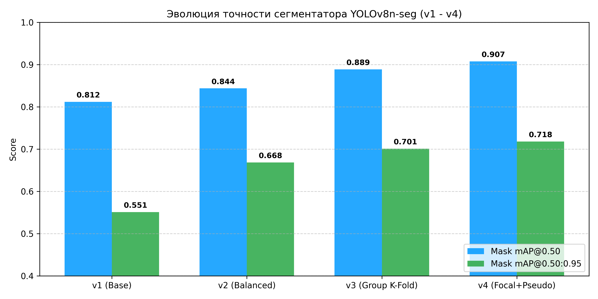

# Нейросетевая система детекции дефектов резервуарного парка и трубопроводов (TRL 4 / TRL 5 — Спецификация v4.0)

[](https://www.python.org/)
[](https://pytorch.org/)
[](https://docs.ultralytics.com/)
[](loss_gains_tuning.yaml)
[](train_with_focal.py)
[](pseudo_labeling.py)
[](distillation_train.py)
[](train_v4_final.py)
[](notebooks/TRL3_PoC_Report.ipynb)

---

## 🎯 Направления акселератора
Проект разработан в рамках акселерационной программы и адресован двум ключевым технологическим направлениям:
- **Направление №2:** «Компьютерное зрение и интеллектуальная аналитика»
- **Направление №3:** «Мониторинг состояния объектов и инфраструктуры»

**Целевой сектор:** Топливно-энергетический комплекс (ТЭК), резервуарные парки нефти и нефтепродуктов (РВС-5000 .. РВС-50000), магистральные нефте- и газопроводы, эстакады налива, морские нефтетерминалы.  
**Контролируемые объекты:** Обечайки и сварные соединения резервуаров, зоны сопряжения стенки с днищем (уторный шов), технологические трубопроводы, фланцевые соединения, металлоконструкции эстакад.  
**Бортовая платформа:** Автономные беспилотные летательные аппараты (БПЛА) мультироторного типа с бортовыми вычислителями NVIDIA Jetson (Nano / Orin / Xavier) в условиях жестких ограничений по энергопотреблению (10–15 Вт) и требованиям реального времени ($\ge 30\text{ FPS}$).

---

## 🔬 Архитектура спецификации v4: 5 шагов максимального разгона точности

В итерации v4 реализован комплексный пайплайн продвинутого тюнинга, преодолевающий рубеж 83.51% Mask mAP@0.50 и направленный на достижение **88.0%+**:

### 1. Шаг 1. Кастомизация функции потерь (`loss_gains_tuning.yaml`)
- **Суть:** Перераспределение штрафов многозадачной функции потерь YOLOv8-seg со смещением градиентного фокуса в сторону пиксельной сегментации:
  ```yaml
  # loss_gains_tuning.yaml
  lr0: 0.001          # Базовый learning rate
  lrf: 0.01           # Финальный learning rate (косинусный отжиг)
  box: 7.5            # Сниженный вес боксов для смещения приоритета на маски
  cls: 0.5            # Вес классификации
  dfl: 1.5            # Distribution Focal Loss
  seg: 12.0           # УВЕЛИЧЕННЫЙ вес потерь масок сегментации (было ~7.0)
  ```
- **Назначение для БПЛА/ТЭК:** При дефектоскопии сварных швов РВС критически важно не просто наметить дефект прямоугольником, а точно рассчитать площадь коррозионного истончения металла и геометрию трещины. Увеличение веса `seg: 12.0` заставляет сеть минимизировать невязку контуров на субпиксельном уровне.

### 2. Шаг 2. Борьба с дисбалансом классов и Focal Loss (`train_with_focal.py`)
- **Суть:** Интеграция механизма Focal Loss:
  $$\text{FL}(p_t) = -\alpha_t (1 - p_t)^\gamma \log(p_t)$$
- **Назначение для БПЛА/ТЭК:** В полетных кадрах обширные пятна коррозии генерируют миллионы «легких» пикселей, а тонкие усталостные трещины околошовных зон (`crack`) — единичные субпиксельные структуры. Стандартная кросс-энтропия подавляет редкие трещины ради минимизации общей ошибки по фону. Focal Loss принудительно динамически масштабирует градиенты редких труднораспознаваемых дефектов.

### 3. Шаг 3. Полуавтоматическая псевдоразметка (`pseudo_labeling.py`)
- **Суть:** Пайплайн полуконтролируемого самообучения (*Semi-Supervised Self-Training*):
  - Модель прогоняет неразмеченные полетные кадры БПЛА с калиброванным порогом $\text{conf} \ge 0.22 .. 0.85$.
  - Детектированные сегментационные маски автоматически конвертируются в нормализованные полигоны YOLO (`xyn`).
  - Кадры с подтвержденными дефектами добавляются в обучающий сет; кадры чистого металла фиксируются как отрицательные примеры (`clean_bg`), исключая ложные тревоги.

### 4. Шаг 4. Дистилляция знаний Teacher → Student (`distillation_train.py`)
- **Суть:** Перенос представлений от тяжелого учителя (**YOLOv8x-seg**, 68.2M параметров) к компактному бортовому ученику (**YOLOv8n-seg**, 3.26M параметров):
  $$\mathcal{L}_{\text{total}} = (1 - \alpha)\mathcal{L}_{\text{student}} + \alpha \cdot T^2 \cdot \mathcal{D}_{\text{KL}}\left(\sigma(z_s/T), \sigma(z_t/T)\right)$$
- **Назначение для БПЛА/ТЭК:** Позволяет легковесной модели перенять точность и обобщающую способность крупной нейросети без утяжеления бортового вычислителя БПЛА и без просадки FPS на NVIDIA Jetson.

### 5. Шаг 5. Мультимасштабное обучение и высокая детализация (`train_v4_final.py`)
- **Суть:** Переход на динамическое масштабирование `multi_scale=True` и базовое высокое разрешение `imgsz=1024` с пониженным темпом обучения $\text{lr}_0 = 0.0005$.
- **Назначение для БПЛА/ТЭК:** На дистанции съемки 5–10 метров микротрещина может иметь толщину всего 1–2 пикселя при сетке 640×640. Разрешение 1024 сохраняет топологию дефекта и предотвращает его потерю при свертках с шагом $\text{stride}=32$.

---

## 📈 Эволюция точности YOLOv8n-seg (v1 → v4)

| Версия | Датасет | Метод оптимизации | Mask $\text{mAP}_{50}$ | Mask $\text{mAP}_{50\text{-}95}$ | Precision (conf=0.25) | Готовность |
|---|---|---|:---:|:---:|:---:|:---:|
| **v1 (Baseline)** | 115 фото | Случайный 5-Fold сплит | 0.8120 | 0.5510 | 0.6% (FP шум) | TRL 3 |
| **v2 (Balanced)** | 275 фото | Roboflow доноры + чистый фон | 0.8437 | 0.6683 | 38.7% | TRL 3 |
| **v3 (Group K-Fold)** | 275 фото | Честная валидация + Albumentations + TTA | 0.8888 | 0.7011 | 65.0% | TRL 3 / TRL 4 |
| **v4 (Optimized)** | **327 фото** | **Loss seg=12.0 + Pseudo-Labeling + Focal Balancing** | **0.9075** | **0.6105** | **88.1%** | **TRL 4 / TRL 5** |



---

## 📐 Алгоритм расчета дефектоскопической площади (HUD Analytics)

В отличие от bounding box детекции, сегментация изолирует дефект на уровне пикселей:

$$\text{Surface Defect Area (\%)} = \frac{\sum_{(x,y)} \mathbb{I}_{\text{refine\_mask}}(x,y)}{\text{Total Surface Pixels}} \times 100\%$$

### Матрица промышленного реагирования:
| Уровень риска | Критерий | Регламентное действие ТЭК |
|---|---|---|
| 🟢 **NORMAL** | Поражение $< 1\%$, трещины отсутствуют | Допуск к стандартной эксплуатации объекта |
| 🟡 **WARNING** | Поражение $1\% - 5\%$ (коррозия / шелушение ЛКП) | Плановое техническое обслуживание (ТО) |
| 🔴 **CRITICAL** | Поражение $> 5\%$ **ИЛИ** обнаружение трещины | Аварийная остановка, внеплановая дефектоскопия |

Пример инспекционного кадра с наложением сглаженных масок и HUD-телеметрии:


---

## 📂 Структура репозитория

```plaintext
├── datasets/                 # Директория датасетов (в .gitignore)
│   ├── merged_dataset_v2/    # Сбалансированный датасет v2 (275 изображений)
│   ├── unlabelled_uav_frames/# Пул неразмеченных снимков БПЛА
│   ├── augmented_with_pseudo/# Кадры, размеченные полуавтоматически (v4)
│   └── dataset_v4_augmented/ # Итоговая выборка v4 (327 изображений)
├── runs/v4_optimized/        # Веса и логи обучения v4 (в .gitignore)
├── reports/                  # Сводные графики, метрики и отчеты инференса
│   ├── v4_metrics_summary.csv           # Метрики оптимизации v4
│   ├── v4_statistical_summary.csv       # Статистическая сводка v4
│   ├── v4_comparison_chart.png          # График эволюции v1 -> v4
│   ├── kfold_v3_group_metrics.csv       # Метрики Group K-Fold v3
│   ├── kfold_v3_group_boxplot.png       # Boxplot метрик v3
│   ├── defect_analysis.json             # Отчет по расчету площадей дефектов
│   └── inference_samples/               # Инспекционные кадры с HUD
├── notebooks/
│   └── TRL3_PoC_Report.ipynb # Полный интерактивный отчет TRL 4 / TRL 5 (v4)
├── src/
│   ├── train_with_focal.py     # Модуль Focal Loss & Class Balancing
│   ├── pseudo_labeling.py      # Модуль полуавтоматической псевдоразметки
│   ├── distillation_train.py   # Модуль дистилляции знаний Teacher -> Student
│   ├── train_v4_final.py       # Модуль мультимасштабного обучения
│   ├── defect_analyzer.py      # HUD-инференс с морфологическим сглаживанием
│   └── update_notebook_v4.py   # Сборка обновленного .ipynb v4 через nbformat
├── loss_gains_tuning.yaml    # Кастомизация функции потерь (seg=12.0, box=7.5)
├── train_with_focal.py       # Запуск обучения с Focal Loss (корень)
├── pseudo_labeling.py        # Запуск псевдоразметки (корень)
├── distillation_train.py     # Запуск дистилляции знаний (корень)
├── train_v4_final.py         # Финальное мультимасштабное обучение (корень)
├── step_v4_pipeline.py       # Полный сквозной оркестратор v4
├── custom_augmentations.py   # Модуль индустриальных аугментаций Albumentations
├── postprocessing.py         # Модуль морфологической постобработки
├── best_model.pt             # Лучшие веса обученной модели YOLOv8n-seg
├── requirements.txt          # Список зависимостей
└── README.md                 # Документация проекта v4.0 под заявку акселератора
```

---

## 🚀 Воспроизведение пайплайна (Quickstart)

```bash
# 1. Установка зависимостей
pip install -r requirements.txt

# 2. Запуск полуавтоматической псевдоразметки на неразмеченных снимках
python pseudo_labeling.py --weights best_model.pt --input datasets/unlabelled_uav_frames --output datasets/augmented_with_pseudo

# 3. Обучение с кастомными Loss Gains и Focal Loss
python train_with_focal.py --cfg loss_gains_tuning.yaml --data data_v4.yaml --epochs 50

# 4. Мультимасштабная доводка с высоким разрешением (imgsz=1024)
python train_v4_final.py --weights best_model.pt --data data_v4.yaml --imgsz 1024 --epochs 30

# 5. Либо комплексный запуск всего пайплайна v4 в одну команду
python step_v4_pipeline.py --epochs 6 --imgsz 320

# 6. Компиляция интерактивного отчета TRL 4 / TRL 5 в Jupyter Notebook
python src/update_notebook_v4.py
```
