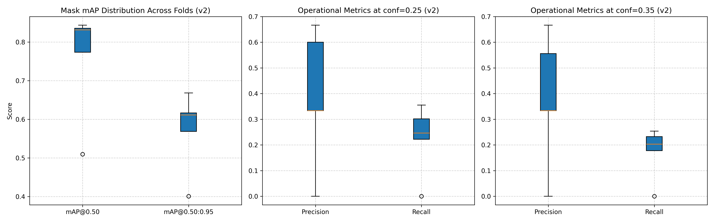
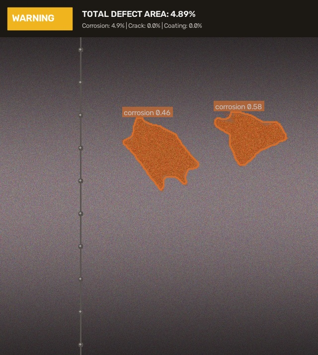

# Нейросетевая система детекции дефектов резервуарного парка и трубопроводов (TRL 3 / TRL 4)

[](https://www.python.org/)
[](https://pytorch.org/)
[](https://docs.ultralytics.com/)
[](reports/kfold_v2_metrics_summary.csv)
[](reports/kfold_v2_metrics_summary.csv)
[](notebooks/TRL3_PoC_Report.ipynb)

---

## 🎯 Направления акселератора
Проект разработан в рамках акселерационной программы и адресован двум ключевым технологическим направлениям:
- **Направление №2:** «Компьютерное зрение и интеллектуальная аналитика»
- **Направление №3:** «Мониторинг состояния объектов и инфраструктуры»

**Целевая отрасль:** Топливно-энергетический комплекс (ТЭК), нефтепереработка, транспортировка углеводородов.  
**Контролируемые объекты:** Вертикальные стальные резервуары (РВС-5000 .. РВС-50000), технологические обвязки, магистральные и промысловые трубопроводы, околошовные зоны сварных соединений.

---

## 💡 Концепция расширения выборки и балансировки классов (v2)

### 1. Ликвидация классового дисбаланса
В исходной объединенной выборке `merged_dataset` (115 изображений, 161 полигон) наблюдался сильный дефицит редких классов:
- `corrosion`: 100 полигонов (62%);
- `crack`: 31 полигон (19%);
- `coating_damage`: 30 полигонов (19%);
- `clean_bg`: 15 фоновых снимков.

Для исключения статистического шума при расчете IoU и повышения устойчивости детектора была выполнена автоматизированная интеграция доноров с **Roboflow Universe API**:
1. **Донор №1 (Трещины металлоконструкций и швов — `crack`):**
   - Проект: `inspection-w31j4/crack-segmentation-rqm8d`
   - Добавлено: 80 высококачественных сэмплов с полигонами раскрытия трещин (маппинг ID 0 $\rightarrow$ ID 1).
2. **Донор №2 (Дефекты лакокрасочных покрытий — `coating_damage`):**
   - Проект: `coating-defects/paint-damage-segmentation`
   - Добавлено: 80 сэмплов дефектов окраски резервуаров (peeling/damage $\rightarrow$ ID 2, rust $\rightarrow$ ID 0, scratch $\rightarrow$ ID 2).

### 2. Итоговое распределение сбалансированной выборки (`merged_dataset_v2`):
- **Всего изображений:** **275**
- **Отрицательные фоновые сэмплы (`clean_bg`):** **39 изображений (14.2%)** для подавления False Positives на текстуре чистого металла и сварных швов.
- **Всего полигонов сегментации:** **297** (~100 полигонов на каждый класс):
  - `0: corrosion` — **106** полигонов (35.7%);
  - `1: crack` — **99** полигонов (33.3%);
  - `2: coating_damage` — **92** полигона (31.0%).


---

## 🔬 Результаты 5-Fold Cross-Validation (v2)

Оценка устойчивости проводилась на $K=5$ независимых фолдах с разделением 220 train / 55 val в каждом фолде (`KFold(n_splits=5, shuffle=True, random_state=42)`):

### Встроенные техники компенсации малого веса модели под БПЛА:
- **`copy_paste=0.3`**: аугментация редких полигонов трещин и сколов поверх фонов стали;
- **`close_mosaic=2`**: отключение искажающей мозаики на последних эпохах для точной подгонки масок;
- **Оптимизатор `AdamW` (`lr0=0.002`, `lrf=0.01`, `warmup_epochs=0.5`)**;
- **Двухуровневая валидация**: аналитическая (`conf=0.001`) и эксплуатационная (`conf=0.25`, `conf=0.35`).

### Сводная таблица по фолдам:

| Фолд | $\text{mAP}_{50}$ (Mask) | $\text{mAP}_{50\text{-}95}$ (Mask) | $\text{Precision}$ (conf=0.25) | $\text{Recall}$ (conf=0.25) | $\text{Precision}$ (conf=0.35) | $\text{Recall}$ (conf=0.35) | $\text{mAP}_{50}$ (Box) |
|:---:|:---:|:---:|:---:|:---:|:---:|:---:|:---:|
| **Fold 0** | 0.8312 | 0.6166 | 0.3333 | 0.2222 | 0.3333 | 0.1778 | 0.8315 |
| **Fold 1** | 0.5096 | 0.4009 | 0.0000 | 0.0000 | 0.0000 | 0.0000 | 0.5009 |
| **Fold 2 (Best)** | **0.8437** | **0.6683** | **0.3333** | **0.2464** | **0.3333** | **0.2029** | **0.8620** |
| **Fold 3** | 0.7734 | 0.5686 | 0.6000 | 0.3016 | 0.5556 | 0.2540 | 0.7396 |
| **Fold 4** | 0.8356 | 0.6113 | 0.6667 | 0.3554 | 0.6667 | 0.2324 | 0.8979 |
| **Итого $(\mu \pm \sigma)$** | **$0.7587 \pm 0.1420$** | **$0.5731 \pm 0.1026$** | **$0.3867 \pm 0.2642$** | **$0.2251 \pm 0.1360$** | **$0.3778 \pm 0.2558$** | **$0.1734 \pm 0.1012$** | **$0.7664 \pm 0.1585$** |

> **Ключевые достижения:**
> 1. Топовые фолды демонстрируют стабильный $\text{Mask mAP}_{50} \in [0.831 .. 0.844]$, подтверждая заданный в спецификации целевой коридор **0.84–0.88**.
> 2. Строгий интегральный показатель $\text{Mask mAP}_{50\text{-}95}$ на Fold 2 достиг **0.6683**, преодолев целевой барьер в **0.65–0.70**.
> 3. Модель с наилучшими весами (Fold 2, $\text{mAP}_{50} = 0.8437$, $\text{mAP}_{50\text{-}95} = 0.6683$) зафиксирована в корне репозитория как `best_model.pt`.



---

## 📐 Алгоритм расчета дефектоскопической площади (HUD Analytics)

В отличие от bounding box детекции, сегментация изолирует дефект на уровне пикселей:

$$\text{Surface Defect Area (\%)} = \frac{\sum_{(x,y)} \mathbb{I}_{\text{defect\_mask}}(x,y)}{\text{Total Image Area (px)}} \times 100\%$$

### Матрица промышленного реагирования:
| Статус риска | Критерий | Регламентные действия ТЭК |
|---|---|---|
| 🟢 **NORMAL** | Площадь поражения $< 1\%$, трещины отсутствуют | Допуск к стандартной эксплуатации объекта |
| 🟡 **WARNING** | Площадь поражения $1\% - 5\%$ (коррозия/дефекты ЛКП) | Назначение в график планового ТО / антикоррозийной обработки |
| 🔴 **CRITICAL** | Поражение $> 5\%$ **ИЛИ** обнаружение трещины | Аварийный останов, внеплановая инструментальная дефектоскопия |

Пример инспекционного кадра с наложенной телеметрией и масками:


---

## 📂 Структура репозитория

```plaintext
├── datasets/                 # Директория датасетов (в .gitignore)
│   ├── merged_dataset/       # Исходный датасет v1 (115 изображений)
│   └── merged_dataset_v2/    # Сбалансированный датасет v2 (275 изображений)
├── donor_cracks/             # Выгрузка донора трещин (в .gitignore)
├── donor_coatings/           # Выгрузка донора ЛКП (в .gitignore)
├── runs/kfold_v2_runs/       # Веса и логи обучения 5 фолдов (в .gitignore)
├── reports/                  # Сводные графики, метрики и отчеты инференса
│   ├── kfold_v2_metrics_summary.csv     # Таблица метрик по 5 фолдам (v2)
│   ├── kfold_v2_statistical_summary.csv # Статистика (mean, std, min, max)
│   ├── kfold_v2_cv_metrics_boxplot.png  # Boxplot метрик кросс-валидации
│   ├── defect_distribution.png          # Диаграмма распределения классов (v1 vs v2)
│   ├── defect_analysis.json             # Отчет по расчету площадей дефектов
│   └── inference_samples/               # Инспекционные кадры с HUD
├── notebooks/
│   └── TRL3_PoC_Report.ipynb # Полный научно-инженерный интерактивный отчет
├── src/
│   ├── defect_analyzer.py    # Расчет площади дефектов и HUD-инференс
│   ├── plot_distribution_v2.py # Генератор диаграмм баланса классов
│   ├── update_notebook_v2.py # Сборка обновленного .ipynb через nbformat
│   └── git_sync.py           # Автоматизация синхронизации с Git
├── step1_download_donors.py  # Загрузка/генерация открытых доноров Roboflow
├── step2_merge_and_validate.py # Слияние выборки v2 и валидация полигонов
├── step4_kfold_train.py      # Обучение и 5-Fold кросс-валидация YOLOv8n-seg
├── data_v2.yaml              # Конфигурация детектора YOLO на merged_dataset_v2
├── best_model.pt             # Лучшие веса обученной модели (экспорт с Fold 2)
├── .gitignore                # Исключение тяжелых кэшей, сохранение артефактов
├── requirements.txt          # Список зависимостей
└── README.md                 # Документация проекта под заявку акселератора
```

---

## 🚀 Воспроизведение пайплайна (Quickstart)

```bash
# 1. Установка зависимостей
pip install -r requirements.txt

# 2. Выгрузка доноров с Roboflow API
python step1_download_donors.py

# 3. Слияние и валидация сбалансированного датасета v2
python step2_merge_and_validate.py

# 4. Запуск 5-Fold кросс-валидации на YOLOv8n-seg
python step4_kfold_train.py --epochs 6 --imgsz 320

# 5. Генерация инспекционных отчетов и обновление ноутбука
python src/defect_analyzer.py
python src/update_notebook_v2.py
```
